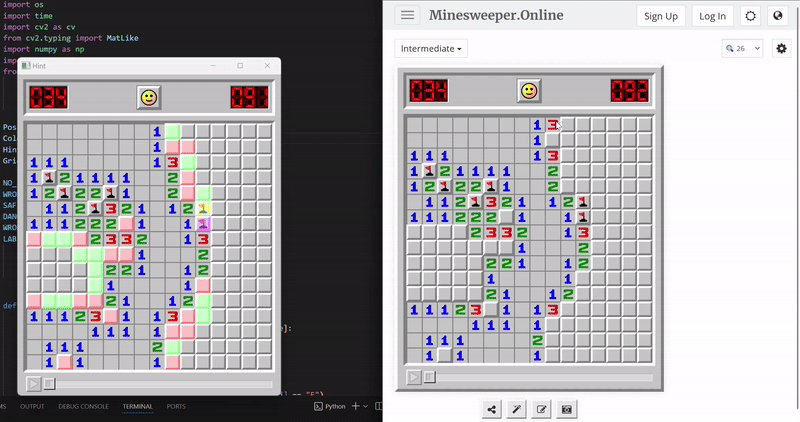
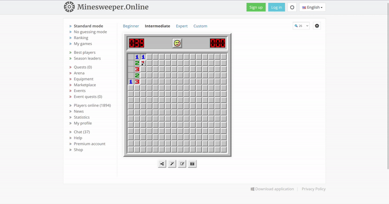
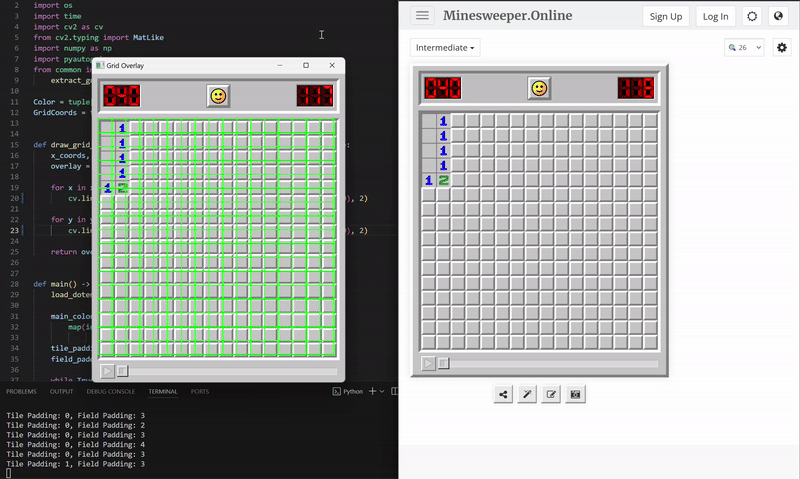

# An updated and improved version of SamuelSoNChino's minesweeper-solver

For now the only work I will be doing will be on the hint.py overlay system

## READ BELOW FOR INSTRUCTIONS AND USAGE
The easy version is:

## 1. Make sure you have Python 3.8+ installed

## 2. (cd to where you downloaded and extracted the folder)


run  ``` pip install -r requirements.txt  ``` 


***In the same command prompt _without_ closing that window***
Run
``` python calibrate.py ``` 

## 3. Place the Minesweeper Online window on the right half of your screen.

   Make sure at least one tile is uncovered.

   Use these keys to adjust:

* W / S → move whole grid (field padding)

* A / D → resize tiles (tile padding)

  * Enter → save and exit


## 4. Adjust config.env if Needed

Open the config.env file if you want to tweak things like:

   CHECK_DELAY → how often the overlay updates (default is fine) 

   MAIN_COLOR → default works for Minesweeper Online light mode
> [!NOTE]
> ensure if using default that the game theme is on "Classic - Light"

> [!IMPORTANT]
> if using the minesweeper online desktop app, make sure the "show brightness" setting is on, and set it to 100

|   |  |
| ------------- | ------------- |
| |  |
|  |    |


## 4. Run the Hint Overlay

Now you’re ready to run the hint system:

``` python hint.py ```

(_or just double click the hint.py file_) 

> [!IMPORTANT] 
> The game window must stay on the right half of the screen.
> The overlay window will open on the left — don’t cover the game window!

✅ Overlay Colors

    🟩 Green = Safe to click

    🟥 Red = Mine (unflagged)

    🟨 Yellow = Wrong flag

    🟪 Purple = Flag placed, but nearby flag might be wrong


(Below is the read.me from the original project) 

(thanks again and all credit goes to SamuelSoNChino, I've been searching for something like this for so long, and with his Ive been able to use it as a base *because learning about pyautogui seems tedious*)


# Minesweeper Solver

Minesweeper Solver is an automated tool designed to assist players in solving Minesweeper on the [Minesweeper Online website](https://minesweeper.online) developed in Python using OpenCV, NumPy and Pyatuogui. The project consists of two main components:

- **Hint Overlay** - Displays a visual guide indicating safe, dangerous, and incorrectly flagged tiles.

    **Showcase**: 
    
    

- **Bot** - Automates tile clicks, solving the game for you with adjustable speed.

    **Showcase**: 
    
    


> **Disclaimer:** Using the bot, especially with really small delays, may result in an IP ban from Minesweeper Online. Use it at your own risk.

## Features

- **Automatic Field Detection**: Identifies and extracts the Minesweeper grid from the screen.

- **Custom Calibration**: Adjusts tile and field padding for various screen resolutions.

- **Hint System**: Provides a visual overlay to guide manual play.

- **Automated Bot**: Clicks tiles intelligently to win the game.

- **Turbo Mode**: Allow the bot to click way faster but increases the risk of misclicking if windows are switched.

## Prerequisites

Ensure you have the following installed:

- **Python 3.8+**

- **Required dependencies**:


        pip install -r requirements.txt


## Before Usage

### Configuration

Before using the solver, you may need to adjust certain settings in the `config.env` file. These settings control how the bot and hint overlay behave.

#### General Settings

- `MAIN_COLOR`
    - The RGB color of the Minesweeper field background (The most common color on the field). 
    
    - Default is set for **light mode** on Minesweeper Online (198,198,198).


- `TILE_PADDING`
    - The spacing between individual tiles.
    
    - This is automatically adjusted during [Calibration](#2-calibration).

- `FIELD_PADDING`
    - The boundary around the Minesweeper grid.
    
    - Also adjusted during [Calibration](#2-calibration).

#### Bot-Specific Settings

- `SCREEN_SCALING`
    - If using **Windows** leave it at `1`

    - Else adjusts for your **OS display scaling** (e.g., `1.25`, `1.5`).
    
    - Required for accurate clicking.

- `CLICK_DELAY`
    - The delay (in milliseconds) between consecutive clicks.
    
    - Increasing this makes the bot slower but more controlled.

- `TURBO_MODE`
    - Enables batch clicking, greatly improving performance.
    
    - Can be riskier if you switch windows during execution.
    
    - Set to `0` to disable or `1` to enable.

#### Hint-Specific Settings

- `CHECK_DELAY`
    - Time (in integer seconds) between hint updates.
    
    - A lower value provides faster updates but may use more CPU.

### 2. Calibration

You must run `calibrate.py` before using any other scripts to ensure they function correctly.

Calibration determines `FIELD_PADDING` and `TILE_PADDING` in `config.env`, as these values vary depending on screen resolution and zoom level.

#### Running Calibration

    python calibrate.py

1. **Prepare Your Screen**:

    - Open [Minesweeper Online](https://minesweeper.online) on the **right half** of your screen.

    - Ensure that **at least one tile is uncovered** for proper detection.

2. **Adjust the Grid Overlay**:

    - A window will open displaying an overlayed **green grid**.

    - Use the following controls to align the green grid with the Minesweeper tiles:

    **Controls:**
    - `W` → Increase **field padding** (moves the whole grid right and down)
    
    - `S` → Decrease **field padding** (moves the whole grid left and up)
    
    - `A` → Decrease **tile padding** (decreases the size of a single tile)
    
    - `D` → Increase **tile padding** (increases the size of a single tile)
    
    - `Enter` → Save the settings and exit

    **Showcase:**

    

3. **Completing Calibration**:
    - Once the grid is correctly aligned, press `Enter`.
    
    - The updated values will be saved in `config.env`.
    
    - You can now proceed with using the **Hint Overlay** or **Bot**.


## Usage

### 1. Running the Hint Overlay

The hint tool scans the Minesweeper board and displays a visual overlay indicating **safe**, **dangerous**, and **flagged** tiles.

    python hint.py

- The hint overlay only scans the **right half** of your screen.

- The **entire Minesweeper field** must be on the right side.

- The **hint window with the overlay** should be moved to the **left half** of the screen.

The overlay colors indicate:

- **Green**: Safe tiles

- **Red**: Unflagged tiles with a mine

- **Yellow**: Incorrectly flagged tiles

- **Purple**: Flags with an incorrectly flagged tile near

You can adjust the **check delay** in `config.env` to control how often the overlay updates.

### 2. Running the Bot

The bot automates gameplay by detecting the board state and clicking tiles accordingly.

    python bot.py

- Unlike the hint tool, the bot **scans the entire screen**.

- The bot will:
    1. Detect the Minesweeper grid and analyze the game state.
    
    2. Identify **safe moves** and flag **mines**.
    
    3. Click tiles **sequentially** in a logical order.
    
    4. Make **random choices when necessary**, as Minesweeper sometimes requires guessing.

The bot will **automatically stop** when it has no moves left after scanning the board twice, basically at the **end of the game**.

## Implementation Details

### 1. `common.py`

- **Purpose**: Provides essential utility functions for detecting, extracting, and processing Minesweeper grid from ascreenshot.

- **Technologies Used**:

    - **OpenCV**: Handles image processing tasks, such as color thresholding, contour detection, and tile classification.
    
    - **NumPy**: Used for array manipulation and efficient color filtering.

- **Key Features**:

    - Detects the Minesweeper playing field using color-based segmentation.
    
    - Extracts tile grid coordinates for further processing.
    
    - Classifies tiles based on their unique colors to interpret game state.
    
    - Implements a function to retrieve neighboring tiles for logical analysis.

### 2. `hint.py`

- **Purpose**: Analyzes Minesweeper tiles and their neighbors to generate visual overlay hint.

- **Technologies Used**:

    - **OpenCV**: Generates an overlay displaying hints on the game board.
    
    - **NumPy**: Performs efficient array-based operations for image manipulation.
    
    - **PyAutoGUI**: Captures screenshots for real-time game state analysis.
    
    - **Dotenv & OS**: Loads configuration settings from environment variables.

- **Key Features**:

    - Evaluates tile neighbors to mark safe moves and potential mines.
    
    - Detects and highlights incorrect flags.
    
    - Generates a transparent overlay displaying hints in a new window.
    
    - Runs continuously, updating hints in real time with adjustable delay.

### 3. `bot.py`

- **Purpose**: Automates playing Minesweeper by analyzing the game state, determining safe moves, and making clicks accordingly.

- **Technologies Used**:

    - **OpenCV**: Processes screenshots to identify game elements.
    
    - **NumPy**: Efficiently processes image data.
    
    - **PyAutoGUI**: Automates mouse clicks for interacting with the game.
    
    - **Dotenv & OS**: Loads configuration settings for customizable behavior.

- **Key Features**:

    - Identifies numbers, flags, and unknown tiles.
    
    - Clicks safe tiles, flags dangerous ones, and avoids uncertain ones unless necessary.
    
    - Enables rapid execution for faster gameplay by turning on turbo mode.

    - Uses hints to decide where to click next dynamically.

### 4. `calibration.py`

- **Purpose**: Helps calibrate the Minesweeper bot by adjusting tile and field padding values for accurate grid detection.

- **Key Features**:

    - Detects the minefield and extracts grid coordinates.
    
    - Displays an overlay of the detected grid.
    
    - Allows real-time adjustment of padding values using `W`, `A`, `S`, `D` keys.
    
    -Saves calibrated settings to `config.env` upon pressing `Enter`.
